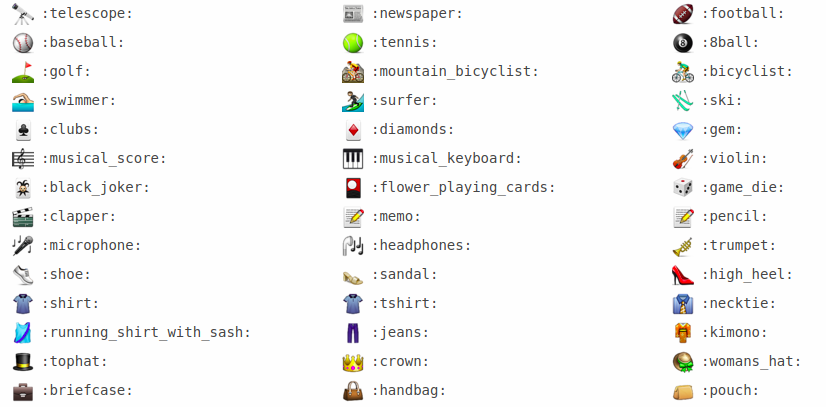

## podmena

Enhance your commit messages with emoji :cherries:

podmena will automatically add random emoji to every commit message for any
git repository installed.



873 items in database so far!

Credits go to [WebpageFX](https://www.webpagefx.com/tools/emoji-cheat-sheet/) 
for list of emoji!

### Installation

```
$ pip install podmena
```
Activate for current git repository
```
$ podmena add local
```
Activate globally for all repositories (works with git `2.9.1` and above)
```
$ git --version
$ podmena add global
```
Deactivate it
```
$ podmena rm local
$ podmena rm global
```
Note that uninstalling globally will not remove hooks from repositories where
it was installed locally. You need to switch to that directory and uninstall it
locally as well.

### See also

* [GitHooks](https://githooks.com/)
* [Atlassian tutorial for git hooks](https://www.atlassian.com/git/tutorials/git-hooks)
Thanks [@kakovskyi](https://github.com/kakovskyi) working for Atlassian!
* [The game of bingo gone horribly wrong](http://lemonparty.club) :lemon:

### Say thanks!

Visit [this page](https://gimmebackmyson.herokuapp.com/) 
and donate some money if you enjoy this _crazy_ project!
